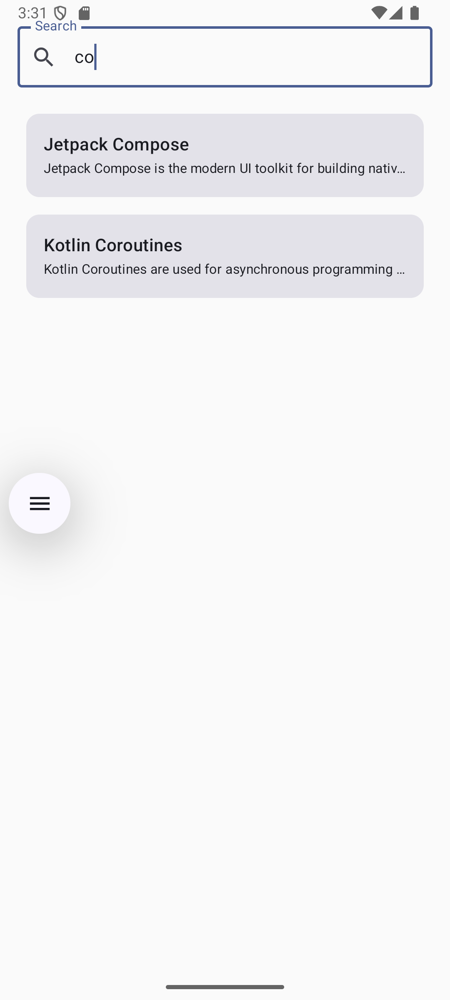

# compose-mvvm-search-app

A simple Android application demonstrating modern Android development using **Jetpack Compose**, **MVVM architecture**, and **Navigation Compose**.

## Features

* Search items by title
* Dynamic list built with **LazyColumn**
* Navigation between list and detail screens
* Material 3 UI components
* Clean architecture with **ViewModel + StateFlow**
* Reusable UI components (ArticleCard)

## Tech Stack

* **Kotlin**
* **Jetpack Compose**
* **Material 3**
* **MVVM Architecture**
* **StateFlow**
* **Navigation Compose**

## Screens

1. **Search Screen**

   * Search items by title
   * Displays list using LazyColumn

2. **Details Screen**

   * Displays full article title and description
   * Includes TopAppBar with back navigation

## Project Structure

```
model
 └ Item.kt

viewmodel
 └ SearchViewModel.kt

ui
 ├ navigation
 │   └ AppNavigation.kt
 ├ screens
 │   ├ SearchScreen.kt
 │   └ DetailsScreen.kt
 └ component
     └ ArticleCard.kt
```

## Architecture

UI (Jetpack Compose)
↓
ViewModel (State management)
↓
StateFlow
↓
UI Recomposition

## GitHub Repository

https://github.com/kuttikatt/compose-mvvm-search-app

## Screenshots

### Search Screen


### Details Screen
